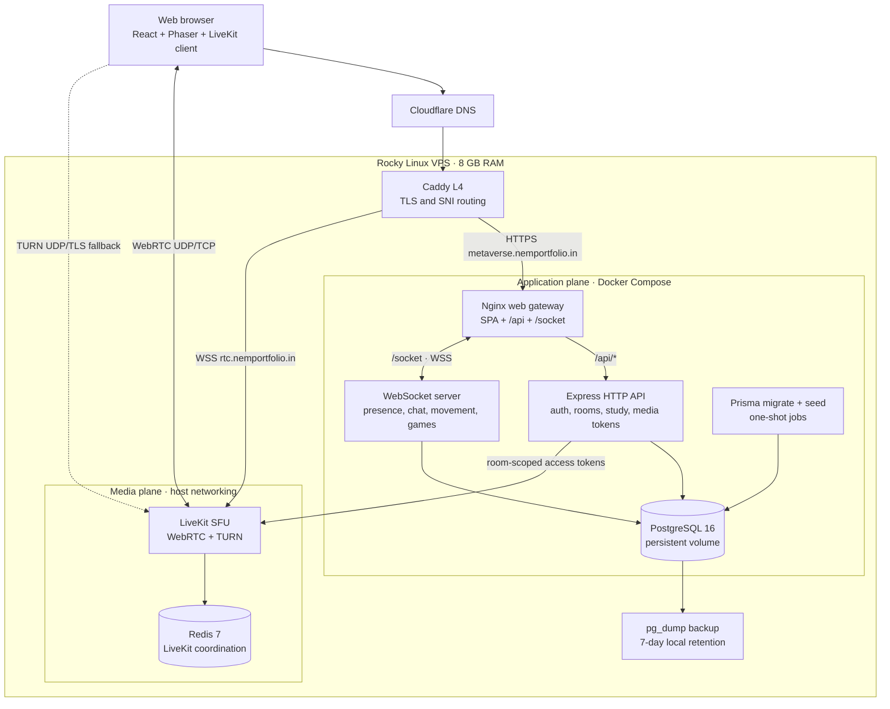

# TrueMetaverse

> A self-hosted, realtime 2D world for studying, meeting, presenting, playing, and simply being together online.

[](https://metaverse.nemportfolio.in)
[](#testing)
[](#testing)
[](#engineering-scorecard)
[](#technology-stack)
[](#docker-setup)

TrueMetaverse combines the immediacy of a multiplayer game with the practical tools of a virtual workspace. Users create or join shared pixel-art spaces, move through collision-aware maps, chat in realtime, customize their characters, study with persistent timers and leaderboards, share a synchronized whiteboard, and use LiveKit-powered audio, video, screen sharing, and TURN fallback. The application is a TypeScript monorepo with an authoritative WebSocket game server, an Express control plane, PostgreSQL persistence, and a fully self-hosted Docker deployment.

## Table of contents

- [Live demo](#live-demo)
- [Demo video](#demo-video)
- [Key features](#key-features)
- [Repository structure](#repository-structure)
- [Engineering scorecard](#engineering-scorecard)
- [Technical highlights](#technical-highlights)
- [Architecture overview and diagram](#architecture-overview-and-diagram)
- [Technology stack](#technology-stack)
- [Prerequisites](#prerequisites)
- [Local development setup](#local-development-setup)
- [Environment variables](#environment-variables)
- [Docker setup](#docker-setup)
- [Available commands and scripts](#available-commands-and-scripts)
- [Testing](#testing)
- [Production deployment architecture](#production-deployment-architecture)
- [Known limitations](#known-limitations)

## Live demo

The production deployment is available at **[metaverse.nemportfolio.in](https://metaverse.nemportfolio.in)**.

Create an account, choose an official map or create a room, and share its six-character join code with another user. Camera and microphone access are optional and are only requested in video-enabled spaces.

## Demo video

<!-- Replace this block with a YouTube, Vimeo, Loom, or local video link. -->

> **Demo video coming soon.**

<!-- > Suggested flow: account creation → Woka customization → room creation and join code → realtime movement/chat → study tools → video and screen share → Hide & Seek round. -->

## Key features

- **Realtime shared worlds** — low-latency WebSocket presence, grid movement, join/leave events, and collision-aware positioning.
- **Five purpose-built maps** — Study Library, Multi-room House, Virtual Office, Classroom, and Enchanted Forest Hide & Seek.
- **Authoritative Hide & Seek** — server-owned roles, timers, tagging, line of sight, concealment zones, spectator states, and visibility filtering for 3–12 players.
- **Woka character customization** — composable character appearance stored per user and synchronized across clients.
- **Room creation and quick join** — create spaces from templates and invite people with short, human-friendly room codes.
- **Realtime chat** — room-scoped messaging with trimming, length limits, and per-user rate limiting.
- **Audio and video rooms** — LiveKit SFU media with camera/microphone controls and participant video docks.
- **Presentation mode** — proximity-aware lectern permissions, screen sharing, and a focused viewer experience.
- **Synchronized classroom whiteboard** — creator-controlled Excalidraw scenes broadcast to everyone in the room, with server-side permission and payload checks.
- **Study sessions and leaderboards** — persistent timers with daily, weekly, monthly, and all-time rankings.
- **Responsive controls** — keyboard movement on desktop plus a pointer-friendly virtual joystick and zoom controls on touch devices.
- **Self-hosted operations** — frontend, APIs, realtime server, PostgreSQL, LiveKit, Redis, TLS, and TURN can all run on one VPS.

## Repository structure

TrueMetaverse is a Bun workspace monorepo. Product code lives under `metaverse/`, cross-service integration tests are kept at the repository root, and deployment infrastructure is separated from application code.

```text
TrueMetaverse/
├── .env.example                    # Safe local-development environment template
├── .gitignore
├── LICENSE                         # MIT license for source contributions
├── CONTRIBUTING.md                 # Contribution workflow and engineering rules
├── README.md                       # Project, development, and deployment documentation
├── Makefile                        # Shortcuts for local and Docker workflows
├── compose.yaml                    # Complete local stack
├── compose.production.yaml         # Production application stack
│
├── deploy/                         # Production-only operational configuration
│   ├── backup-postgres.sh          # Compressed pg_dump with seven-day retention
│   └── livekit/
│       ├── compose.yaml            # Caddy, LiveKit, and Redis services
│       ├── caddy.yaml              # TLS and SNI routing for app, RTC, and TURN
│       ├── livekit.yaml            # SFU, ICE, UDP ranges, and TURN configuration
│       └── redis.conf              # Loopback-only LiveKit coordination store
│
├── metaverse/                      # Bun and Turborepo application workspace
│   ├── package.json                # Root scripts and workspace declarations
│   ├── bun.lock                    # Reproducible dependency lockfile
│   ├── turbo.json                  # Monorepo task graph
│   ├── Dockerfile                  # HTTP, WebSocket, and web image stages
│   ├── docker/
│   │   └── nginx.conf              # SPA serving, API proxy, and WS upgrade rules
│   ├── livekit/                    # Lightweight local LiveKit configuration
│   │   ├── docker-compose.yml
│   │   └── livekit.yaml
│   │
│   ├── apps/
│   │   ├── web/                    # Browser application
│   │   │   ├── public/
│   │   │   │   └── assets/
│   │   │   │       ├── spaces/     # Maps, collision grids, music, and game config
│   │   │   │       │   ├── classroom/
│   │   │   │       │   ├── garden-library/
│   │   │   │       │   ├── hide-and-seek/
│   │   │   │       │   ├── multiroom-house/
│   │   │   │       │   └── virtual-office/
│   │   │   │       └── woka/       # Layered body, eyes, hair, clothes, hats, accessories
│   │   │   ├── src/
│   │   │   │   ├── components/     # HUD, video, whiteboard, controls, and dialogs
│   │   │   │   ├── game/
│   │   │   │   │   ├── config/     # Space capability and map configuration
│   │   │   │   │   ├── entities/   # Local/remote players and Woka entities
│   │   │   │   │   ├── scenes/     # Phaser boot, base, and multiplayer scenes
│   │   │   │   │   ├── systems/    # Movement, collision, camera, and map tools
│   │   │   │   │   └── woka/       # Character configuration and rendering
│   │   │   │   ├── hooks/          # Realtime, chat, video, study, music, presentation
│   │   │   │   ├── lib/            # API client, auth, WS client, formatting, UI helpers
│   │   │   │   ├── pages/          # Auth, dashboard, arena, and study-demo routes
│   │   │   │   ├── App.tsx         # Protected routes and lazy page boundaries
│   │   │   │   └── main.tsx        # React application entrypoint
│   │   │   ├── vite.config.ts      # Vite, Tailwind, proxies, and collision editor
│   │   │   └── package.json
│   │   │
│   │   ├── http/                   # Express control plane
│   │   │   ├── middleware/         # JWT request authentication
│   │   │   ├── routes/v1/          # Auth, users, rooms, study, and LiveKit tokens
│   │   │   ├── types/              # Zod request schemas local to the API
│   │   │   ├── config.ts           # JWT and LiveKit configuration
│   │   │   ├── scrypt.ts           # Salted password hashing and verification
│   │   │   └── index.ts            # HTTP server entrypoint and health endpoint
│   │   │
│   │   └── ws/                     # Authoritative realtime application server
│   │       ├── index.ts             # WebSocket listener and connection lifecycle
│   │       ├── User.ts              # Join, movement, chat, whiteboard, and game input
│   │       ├── RoomManager.ts       # Presence, broadcasts, rooms, and game state
│   │       ├── collision.ts         # Server-side bounds and collision loading
│   │       ├── hideSeekConfig.ts    # Map validation, concealment, and line of sight
│   │       └── *.test.ts            # Authoritative game and map regression tests
│   │
│   └── packages/                   # Shared workspace libraries
│       ├── db/
│       │   ├── prisma/
│       │   │   ├── schema.prisma    # PostgreSQL data model
│       │   │   └── migrations/      # Ordered, deployable schema changes
│       │   ├── client.ts            # Shared Prisma client
│       │   └── seed.ts              # Idempotent maps, avatars, and official room seed
│       ├── types/                   # Shared HTTP, WS, game, and Woka contracts
│       ├── ui/                      # Reusable UI package
│       ├── eslint-config/           # Shared lint configuration
│       └── typescript-config/       # Shared TypeScript compiler presets
│
└── tests/                           # Jest black-box integration suite
    ├── helpers.ts                   # HTTP/WS clients and reusable test fixtures
    ├── auth.test.ts                 # Signup and signin behavior
    ├── rooms.test.ts                # Creation, codes, ownership, and deletion
    ├── movement.test.ts             # Join, movement, collision, and disconnects
    ├── chat.test.ts                 # Broadcast, validation, and rate limiting
    ├── livekit.test.ts              # Media tokens and presentation permissions
    ├── metadata.test.ts             # Avatar and Woka metadata APIs
    ├── study.test.ts                # Timers and leaderboards
    └── catalog.test.ts              # Seeded maps and avatars
```

## Architecture overview and diagram


The system is deliberately split into an **application plane** and a **media plane**. The application plane owns identity, room metadata, study data, movement, chat, whiteboards, and game rules. The media plane owns high-bandwidth WebRTC audio, video, and screen sharing. In production both planes run on the same VPS, but the boundary allows LiveKit or PostgreSQL to move to dedicated infrastructure later.



### Where to make common changes

| Change                             | Primary location                                      | Usually also check                                                |
| ---------------------------------- | ----------------------------------------------------- | ----------------------------------------------------------------- |
| Page, modal, HUD, or responsive UI | `metaverse/apps/web/src/components` and `pages`       | `styles.css`, relevant hooks, production bundle size              |
| Player rendering or movement feel  | `web/src/game/entities`, `scenes`, and `systems`      | Shared WS messages and server collision validation                |
| API endpoint or authentication     | `metaverse/apps/http/routes/v1`                       | Zod schemas, middleware, Prisma, and integration tests            |
| Presence, chat, or game rules      | `metaverse/apps/ws`                                   | `packages/types`, web connection hooks, and Bun tests             |
| Shared protocol shape              | `metaverse/packages/types`                            | Every sender, receiver, and protocol-focused test                 |
| Database model                     | `metaverse/packages/db/prisma/schema.prisma`          | New migration, seed behavior, API queries, and deployment startup |
| Map geometry or gameplay           | `web/public/assets/spaces/<map>`                      | Collision connectivity, spawn points, server config tests         |
| Video, screen share, or TURN       | Web media hooks plus `deploy/livekit`                 | HTTP token permissions, firewall ports, integration tests         |
| Docker or public routing           | Root Compose files, `metaverse/docker`, and `deploy/` | `.env.example`, health checks, README, rollback procedure         |

The frontend and WebSocket server intentionally share protocol types but not authority: the browser renders and requests actions, while the server validates and decides the resulting shared state.

## Engineering scorecard

Measured on 15 July 2026 from the current working tree. Bundle filenames are content-hashed and will change between builds.

| Signal                       |                                    Current value | Scope and interpretation                                                                                                                                                           |
| ---------------------------- | -----------------------------------------------: | ---------------------------------------------------------------------------------------------------------------------------------------------------------------------------------- |
| Physical source lines        |                        **9,143** across 79 files | TS, TSX, JS, JSX, CSS, and Prisma under `metaverse/apps` and `metaverse/packages`; dependencies, generated clients, build output, and the external integration suite are excluded. |
| Automated scenarios          |                           **63** across 11 files | 11 Bun unit/regression scenarios plus 52 Jest integration scenarios.                                                                                                               |
| Fast suite                   |                                **11/11 passing** | 58 assertions across player labels, map integrity, collision/visibility behavior, and authoritative Hide & Seek rounds.                                                            |
| Tested-module coverage       |                    **84% lines / 84% functions** | Bun coverage across the four instrumented realtime/game modules. This is not whole-repository coverage.                                                                            |
| Production transform         |                                **2,445 modules** | Vite 7 production build; measured build time was 22.27 seconds on the development machine.                                                                                         |
| Initial app shell            |           **332.29 kB minified / 96.67 kB gzip** | Entry JavaScript and CSS only: 270.88 kB JS + 61.41 kB CSS. Fonts, maps, images, and lazy features are excluded.                                                                   |
| Representative lazy bundles  | **Arena 337.05 kB gzip; LiveKit 133.68 kB gzip** | Heavy collaboration features are loaded after the initial route. The largest shared whiteboard dependency is currently 741.39 kB gzip.                                             |
| Complete static distribution |                                 **26.19 MB raw** | Includes application chunks, five map packages, character art, fonts, and other public assets.                                                                                     |
| Hide & Seek room capacity    |                                 **3–12 players** | Enforced by the shipped game configuration.                                                                                                                                        |
| Global concurrent users      |                            **Benchmark pending** | Production currently uses one in-memory WebSocket process. No responsible global concurrency claim should be published until WebSocket and LiveKit load tests are run together.    |
| Production footprint         |                                 **1 × 8 GB VPS** | Seven long-running containers plus migration and seed jobs. PostgreSQL data is persisted in a Docker volume.                                                                       |

## Technical highlights

- **Authoritative realtime rules:** the server validates JWTs, room membership, one-tile movement, map bounds, collision, Hide & Seek phase rules, visibility, and tags before broadcasting state.
- **Privacy-aware Hide & Seek:** concealed hider coordinates are withheld, visibility is calculated per viewer, and line-of-sight checks stop at collision tiles.
- **Typed protocol boundary:** shared TypeScript message contracts keep the React client and WebSocket server aligned.
- **Same-origin application gateway:** Nginx serves the SPA, forwards `/api/*` to Express, and upgrades `/socket` to the WebSocket service, avoiding browser CORS complexity.
- **Independent media plane:** LiveKit carries audio, video, and screen-share media while application presence and gameplay remain on the WebSocket server.
- **Defensive realtime inputs:** malformed frames are ignored, chat is rate-limited, whiteboard updates have element and byte limits, and metadata lookups are capped and batched.
- **Collision as data:** each map ships an explicit grid, allowing the client and server to apply the same movement boundaries.
- **Reproducible containers:** one multi-stage Dockerfile produces separate HTTP, WebSocket, and Nginx images from the same frozen Bun lockfile.
- **Safe startup order:** Compose waits for PostgreSQL, applies Prisma migrations, performs idempotent seeding, checks HTTP health, and only then starts the public web gateway.
- **Production operability:** container health checks, bounded local logs, persistent database storage, a PostgreSQL backup script, and TURN fallback are included.


### Architecture diagram prompt

</details>

## Technology stack

| Layer                      | Technology                                          | Responsibility                                                                         |
| -------------------------- | --------------------------------------------------- | -------------------------------------------------------------------------------------- |
| Web application            | React 19, React Router 7, TypeScript 5.9            | Routes, UI state, authentication, controls, and collaboration surfaces                 |
| 2D world                   | Phaser 3.90                                         | Map rendering, sprites, camera, grid movement, and collision feedback                  |
| Styling                    | Tailwind CSS 4, custom CSS                          | Responsive pixel-inspired design system and touch controls                             |
| Build tooling              | Vite 7, Turborepo 2, Bun workspaces                 | Development server, production bundling, task orchestration, and dependency management |
| HTTP control plane         | Express 5, Zod 4, JSON Web Tokens                   | Authentication, users, maps, spaces, study sessions, and media authorization           |
| Realtime application plane | Bun, `ws` 8, shared TypeScript contracts            | Presence, movement, chat, whiteboards, and authoritative game state                    |
| Media plane                | LiveKit 1.13, Redis 7, WebRTC, TURN                 | Audio, camera video, screen sharing, SFU routing, and restrictive-network fallback     |
| Whiteboard                 | Excalidraw 0.18                                     | Synchronized, creator-controlled classroom canvas                                      |
| Data layer                 | PostgreSQL 16, Prisma 7, `pg`                       | Persistent users, spaces, templates, avatars, and study sessions                       |
| Production web gateway     | Nginx 1.27                                          | Static assets, SPA fallback, HTTP proxying, and WebSocket upgrades                     |
| Public TLS gateway         | Caddy L4                                            | Automated certificates and SNI routing for app, LiveKit, and TURN domains              |
| Infrastructure             | Docker, Docker Compose, Rocky Linux, Cloudflare DNS | Repeatable service lifecycle and public routing                                        |
| Testing                    | Bun test, Jest 30, ts-jest                          | Fast module tests and cross-service integration scenarios                              |

## Prerequisites

The complete Docker workflow is the easiest way to run the project.

- **Git**
- **Docker Engine** with the **Docker Compose v2** plugin
- **GNU Make** for the documented shortcuts
- **Bun 1.2+** for host development; the current environment and production image use Bun 1.3.14
- **Node.js 18+ and pnpm** only when running the separate Jest integration suite
- A Linux host is recommended for the local LiveKit configuration because it uses host networking

Make sure these ports are available for the complete local stack:

|        Port | Protocol | Local purpose                               |
| ----------: | -------- | ------------------------------------------- |
|        5173 | TCP      | Public Nginx/Vite web entrypoint            |
|        3000 | TCP      | HTTP API                                    |
|        3001 | TCP      | Application WebSocket server                |
|        5433 | TCP      | PostgreSQL exposed by the full Docker stack |
|   7880–7881 | TCP      | LiveKit signaling and ICE/TCP fallback      |
|        3478 | UDP      | Local TURN                                  |
| 50000–60000 | UDP      | LiveKit WebRTC media                        |

## Local development setup

### Option A: complete Docker stack

```bash
git clone https://github.com/Shivam583-hue/TrueMetaverse.git
cd TrueMetaverse
cp .env.example .env
```

Replace the development secrets in `.env`, then validate and start everything:

```bash
make docker-config
make docker-up
```

Open **http://localhost:5173**. Database migration and seed jobs run automatically before the application services start.

```bash
make docker-logs  # follow all service logs
make docker-down  # stop services and preserve PostgreSQL data
```

### Option B: host processes with Vite hot reload

Stop the complete Compose stack first if it is running, then install dependencies and prepare PostgreSQL:

```bash
make docker-down
make setup
docker compose -f metaverse/livekit/docker-compose.yml up -d
make run
```

This runs Express on port 3000, the WebSocket server on 3001, and Vite on 5173. `make run` keeps all three foreground processes together so `Ctrl+C` stops them as a group.

## Environment variables

Copy `.env.example` to `.env` for local Docker development. Production secrets belong in `/opt/truemetaverse/.env.production` and must never be committed.

| Variable                | Required                   | Purpose                                                                        |
| ----------------------- | -------------------------- | ------------------------------------------------------------------------------ |
| `POSTGRES_DB`           | Docker                     | Database name; defaults to `truemetaverse` locally                             |
| `POSTGRES_USER`         | Docker                     | PostgreSQL role used by the application                                        |
| `POSTGRES_PASSWORD`     | Production                 | PostgreSQL password; use a long random value                                   |
| `POSTGRES_PORT`         | No                         | Local host port for PostgreSQL; defaults to `5433` in the full stack           |
| `DATABASE_URL`          | Host processes             | Complete PostgreSQL connection string used by Prisma and `pg`                  |
| `JWT_PASSWORD`          | Production                 | Secret used to sign seven-day application access tokens                        |
| `LIVEKIT_API_KEY`       | Media-enabled environments | Shared API key used by the HTTP service and LiveKit                            |
| `LIVEKIT_API_SECRET`    | Media-enabled environments | Long shared secret used to sign LiveKit access tokens                          |
| `LIVEKIT_PUBLIC_URL`    | Docker/production          | Browser-reachable signal URL, such as `wss://rtc.example.com`                  |
| `LIVEKIT_URL`           | Direct app configuration   | Public LiveKit URL used when Compose is not translating `LIVEKIT_PUBLIC_URL`   |
| `LIVEKIT_INTERNAL_URL`  | No                         | Server-to-server LiveKit address; defaults to `LIVEKIT_URL` outside Compose    |
| `HTTP_PORT`             | No                         | Local exposed API port; defaults to `3000`                                     |
| `WS_PORT`               | No                         | Local exposed WebSocket port; defaults to `3001`                               |
| `WEB_PORT`              | No                         | Local exposed web port; defaults to `5173`                                     |
| `PORT`                  | Service-level              | Internal HTTP or WebSocket listen port; supplied by Compose                    |
| `VITE_WS_URL`           | No                         | Explicit browser WebSocket URL; same-origin `/socket` is the default           |
| `VITE_API_PROXY_TARGET` | No                         | Vite development proxy target for `/api`; defaults to `http://localhost:3000`  |
| `VITE_WS_PROXY_TARGET`  | No                         | Vite development proxy target for `/socket`; defaults to `ws://localhost:3001` |

A suitable local `.env` starts with:

```dotenv
POSTGRES_DB=truemetaverse
POSTGRES_USER=postgres
POSTGRES_PASSWORD=replace-with-a-random-local-password
POSTGRES_PORT=5433

JWT_PASSWORD=replace-with-a-long-random-secret

LIVEKIT_API_KEY=devkey
LIVEKIT_API_SECRET=replace-with-at-least-32-random-characters
LIVEKIT_PUBLIC_URL=ws://localhost:7880

HTTP_PORT=3000
WS_PORT=3001
WEB_PORT=5173
```

Generate secrets with a password manager or, on Linux/macOS, `openssl rand -hex 32`.

## Docker setup

The root `compose.yaml` defines a complete local environment:

| Service   | Lifecycle    | Role                                                                 |
| --------- | ------------ | -------------------------------------------------------------------- |
| `db`      | Long-running | PostgreSQL with a named persistent volume                            |
| `migrate` | One-shot     | Applies committed Prisma migrations after PostgreSQL becomes healthy |
| `seed`    | One-shot     | Idempotently inserts maps, avatars, and the official space           |
| `livekit` | Long-running | Local LiveKit SFU and TURN service                                   |
| `http`    | Long-running | Express API, authentication, data, and LiveKit tokens                |
| `ws`      | Long-running | Application realtime server and game authority                       |
| `web`     | Long-running | Nginx static frontend and same-origin reverse proxy                  |

Common lifecycle commands:

```bash
docker compose config --quiet
docker compose up --build -d
docker compose ps -a
docker compose logs -f
docker compose down
```

To intentionally erase the local database and start clean:

```bash
make docker-reset
```

> `docker-reset` deletes the PostgreSQL volume. `docker-down` does not.

The multi-stage `metaverse/Dockerfile` shares the frozen Bun dependency layer, generates the Prisma client once, and emits separate `http`, `ws`, and `web` targets.

## Available commands and scripts

### Root Make targets

| Command              | Description                                                            |
| -------------------- | ---------------------------------------------------------------------- |
| `make help`          | List the development and Docker commands                               |
| `make setup`         | Install dependencies, start PostgreSQL, push the schema, and seed data |
| `make run`           | Run HTTP, WebSocket, and Vite processes together                       |
| `make db`            | Create or start the host-development PostgreSQL container              |
| `make db-push`       | Push the Prisma schema to the local database                           |
| `make seed`          | Seed avatars, map templates, and the official room                     |
| `make stop`          | Stop the host-development PostgreSQL container                         |
| `make clean`         | Remove the host-development PostgreSQL container                       |
| `make docker-config` | Validate the root Compose configuration                                |
| `make docker-up`     | Build and start the complete Compose stack                             |
| `make docker-down`   | Stop Compose without deleting database data                            |
| `make docker-logs`   | Follow logs from every Compose service                                 |
| `make docker-reset`  | Remove Compose services and delete the database volume                 |

### Monorepo scripts

Run these from `metaverse/`:

| Command                          | Description                                                  |
| -------------------------------- | ------------------------------------------------------------ |
| `bun install --frozen-lockfile`  | Install exactly the locked workspace dependencies            |
| `bun run dev`                    | Run persistent workspace development tasks through Turborepo |
| `bun run build`                  | Build every workspace that defines a build task              |
| `bun run check-types`            | Type-check participating workspaces                          |
| `bun run lint`                   | Run participating workspace lint tasks                       |
| `bun run format`                 | Format TypeScript, TSX, and Markdown with Prettier           |
| `bun test`                       | Run the fast Bun unit/regression suite                       |
| `bun test --coverage`            | Run the fast suite with line and function coverage           |
| `bun run --cwd apps/web build`   | Type-check and create the Vite production frontend           |
| `bun run --cwd apps/web preview` | Preview the built frontend locally                           |
| `bun run --cwd apps/ws test`     | Run only WebSocket/game tests                                |

## Testing

### Bun unit and regression suite

```bash
cd metaverse
bun test
bun test --coverage
```

Current result: **11 passing, 0 failing**, with **84.70% line coverage** across the four modules loaded by this suite.

The fast suite covers:

- Hide & Seek configuration and asset alignment
- Spawn and river-crossing connectivity
- Collision-aware line of sight
- Authoritative round roles, phases, tags, concealment, and disconnects
- Non-empty player labels when user metadata arrives late

### Jest cross-service integration suite

Start the complete local stack first, then run:

```bash
make docker-up
cd tests
pnpm install --frozen-lockfile
pnpm test -- --runInBand
```

Current result: **48 passing, 4 failing (legacy garbage, will remove this), 52 total**. Authentication, catalog, rooms, metadata, chat, study, and LiveKit suites pass. Four movement assertions still target the old `space-joined.users` coordinate shape; the server now separates presence from `visibleUsers` and the tests need to be updated to the current protocol.

Coverage shown in this README comes from Bun's instrumented fast suite. Jest integration coverage is not currently collected, so combining it into the coverage percentage would be misleading.

## Production deployment architecture

The live environment is self-hosted on one Rocky Linux VPS with 8 GB RAM. The frontend and PostgreSQL database are on the same server as the APIs; Vercel and Neon are not involved.

### Public routing

| Public endpoint                     | Caddy destination               | Purpose                      |
| ----------------------------------- | ------------------------------- | ---------------------------- |
| `https://metaverse.nemportfolio.in` | Nginx on `127.0.0.1:5173`       | SPA, `/api/*`, and `/socket` |
| `wss://rtc.nemportfolio.in`         | LiveKit on `127.0.0.1:7880`     | Media signaling              |
| `turn.nemportfolio.in`              | LiveKit TURN on ports 3478/5349 | UDP and TLS relay fallback   |

Cloudflare provides DNS. Caddy obtains certificates and routes TLS by SNI. LiveKit media additionally uses UDP ranges 30000–40000 for relayed traffic and 50000–60000 for direct WebRTC media.

### Runtime layout

- `/opt/truemetaverse` contains application source, Compose files, deployment configuration, and `.env.production`.
- `compose.production.yaml` runs PostgreSQL, migration, seed, HTTP, WebSocket, and Nginx services.
- `deploy/livekit/compose.yaml` runs Caddy, LiveKit, and Redis with host networking.
- Only Nginx is exposed from the application Compose network, and only on loopback; Caddy is the public TLS entrypoint.
- PostgreSQL persists in the `postgres-data` Docker volume.
- Container logs rotate at 10 MB with five retained files per service.
- `deploy/backup-postgres.sh` creates compressed `pg_dump` backups and removes local backups older than seven days.

### Rebuild and redeploy

After delivering updated source to `/opt/truemetaverse`, rebuild first and then recreate the affected containers:

```bash
cd /opt/truemetaverse

docker compose \
  --env-file .env.production \
  -f compose.production.yaml \
  build

docker compose \
  --env-file .env.production \
  -f compose.production.yaml \
  up -d
```

Verify the deployment:

```bash
docker compose --env-file .env.production -f compose.production.yaml ps -a
docker compose --env-file .env.production -f compose.production.yaml logs --tail=100 http ws web
curl -fsS https://metaverse.nemportfolio.in/healthz
```

`migrate` and `seed` ending in `Exited (0)` is expected: they are successful one-shot jobs.

### Scaling path

1. Load-test WebSocket gameplay and LiveKit media separately, then together, to establish real CPU, memory, bandwidth, and latency limits.
2. Move PostgreSQL backups off-host and move PostgreSQL to a dedicated or managed server when database contention becomes visible.
3. Make room and whiteboard state external or partition rooms with sticky routing before adding WebSocket replicas.
4. Replicate the stateless HTTP service behind the gateway.
5. Add LiveKit nodes using Redis-backed coordination when media bandwidth, not application traffic, becomes the bottleneck.

## Contributing

Contributions are welcome. See [CONTRIBUTING.md](CONTRIBUTING.md)
for local setup, architectural rules, testing expectations, and the pull-request process.

## Known limitations

- **No certified global concurrency figure:** the 8 GB production VPS has not undergone a combined WebSocket, WebRTC, and TURN load test. Hide & Seek is intentionally capped at 12 players per room; other rooms do not yet enforce a hard participant cap.
- **Single WebSocket authority:** room, whiteboard, and active game state are held in one process. Restarting it clears ephemeral state, and horizontal replicas would diverge without shared state or deterministic room routing.
- **Single-server failure domain:** the app, PostgreSQL, Redis, LiveKit, and local backups currently share one VPS. A host failure can affect every layer; backups should also be copied offsite.
- **Four stale integration assertions:** 48 of 52 integration scenarios pass. The remaining movement tests need to adopt the newer split between presence identities and visible player coordinates.
- **Large collaboration chunks:** the initial shell is compact, but the Excalidraw/diagram dependency graph produces a 741.39 kB gzip shared lazy chunk. More granular whiteboard code splitting would improve first-open latency on slow devices.
- **JWT storage:** seven-day bearer tokens are stored in browser `localStorage`. Moving to secure, `HttpOnly`, same-site cookies would reduce token exposure during a successful XSS attack.
- **Local LiveKit favors Linux:** the development configuration uses host networking and is less portable to Docker environments without equivalent host-network support.
- **No automated CI gate is committed yet:** tests, type checks, builds, and deployment verification are currently operator-run rather than enforced on every pull request.

---

## Security

Please do not report security vulnerabilities through public issues.
Contact me through email on shivamshivamshivam456@gmail.com or discord, username is duskwidow.

## License

The source code is licensed under the [MIT License](LICENSE).

Third-party maps, character assets, fonts, music, icons, and other media
remain subject to their respective licenses.
Built as a practical exploration of multiplayer world state, collaboration UX, WebRTC infrastructure, and self-hosted production operations.
